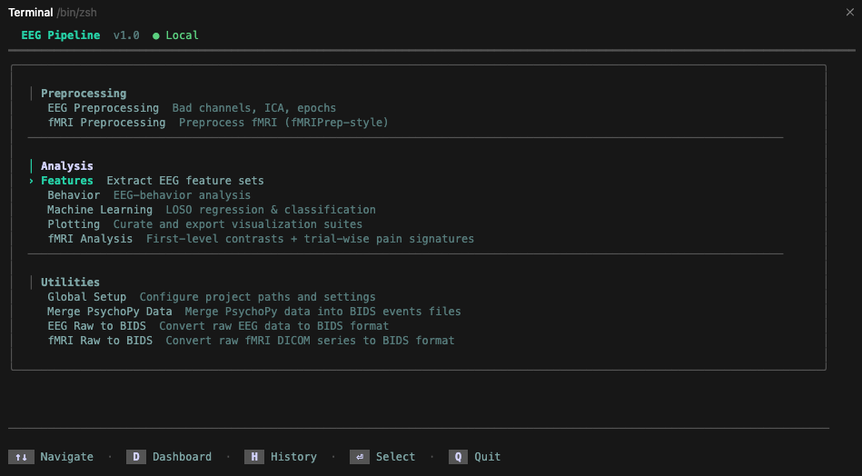
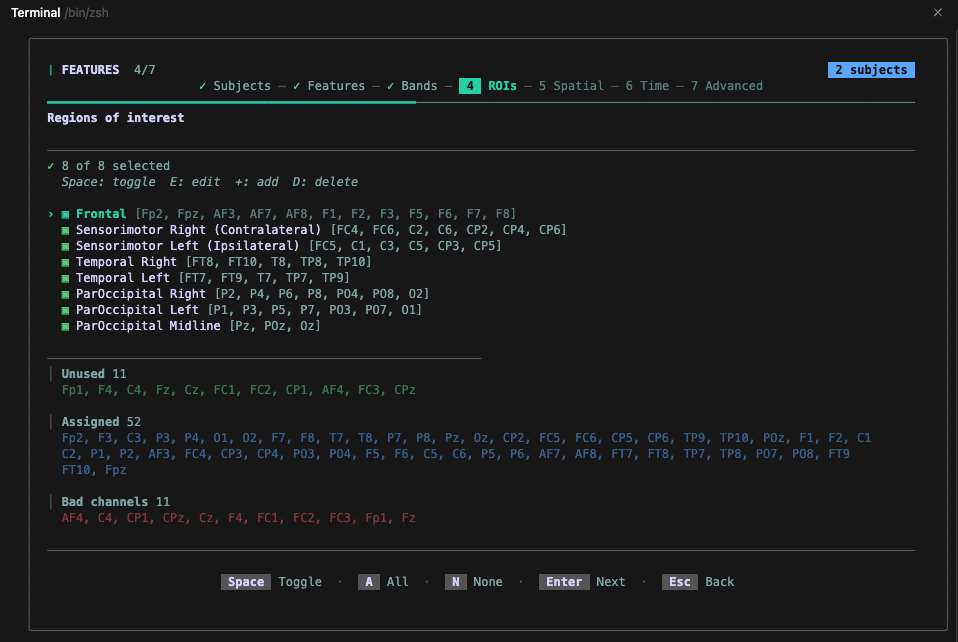

# EEG–fMRI Analysis Pipeline

[](https://www.python.org)
[](LICENSE)
[](https://bids-specification.readthedocs.io/)
[](https://mne.tools)

A modular, end-to-end pipeline for simultaneous EEG–fMRI thermal pain research. Covers raw data conversion, preprocessing, feature extraction, behavioral analysis, machine learning, fMRI first-level analysis, and publication-ready visualization — all from a unified CLI.

**This pipeline ships with a dedicated interactive TUI** that provides guided wizards for every stage — no CLI flags to memorize. See [Interactive TUI](#interactive-tui).

### TUI Showcase

<table>
  <tr>
    <td align="center"><br/><b>Main Menu</b> — All pipeline stages at a glance</td>
    <td align="center"><br/><b>ROI Configuration</b> — Edit channel groupings live</td>
  </tr>
</table>

---

## Table of Contents

- [Quick Start](#quick-start)
- [Installation](#installation)
- [Data Requirements](#data-requirements)
- [Project Structure](#project-structure)
- [Pipeline Overview](#pipeline-overview)
  - [1. Utilities — Data Conversion](#1-utilities--data-conversion)
  - [2. Preprocessing](#2-preprocessing)
  - [3. Feature Extraction](#3-feature-extraction)
  - [4. Behavioral Analysis](#4-behavioral-analysis)
  - [5. Machine Learning](#5-machine-learning)
  - [6. fMRI Preprocessing](#6-fmri-preprocessing)
  - [7. fMRI Analysis](#7-fmri-analysis)
  - [8. Plotting](#8-plotting)
  - [9. Validation](#9-validation)
  - [10. Stats & Info](#10-stats--info)
- [Interactive TUI](#interactive-tui)
- [Configuration](#configuration)
- [Subject Selection](#subject-selection)
- [Output Formats](#output-formats)
- [Advanced Topics](#advanced-topics)
- [Dependencies](#dependencies)
- [License](#license)
- [Contributing](#contributing)
- [Citation](#citation)

---

## Quick Start

```bash
# 1. Clone and install
git clone <repo-url> && cd EEG_fMRI_Pipeline
pip install -e .

# 2. Place your data (see "Data Requirements" below)

# 3. Preprocess
eeg-pipeline preprocessing full --subject 0001

# 4. Extract features
eeg-pipeline features compute --subject 0001

# 5. Behavioral correlations
eeg-pipeline behavior compute --subject 0001

# 6. Visualize
eeg-pipeline features visualize --subject 0001
eeg-pipeline behavior visualize --subject 0001
```

Or launch the TUI for a fully guided experience:

```bash
cd eeg_pipeline/cli/tui && go build -o eeg-tui . && ./eeg-tui
```

---

## Installation

**Requirements:** Python ≥ 3.9

```bash
# Create and activate a virtual environment
python -m venv .venv311
source .venv311/bin/activate

# Install dependencies
pip install -r requirements.txt

# Install the pipeline (editable)
pip install -e .
```

After installation, the `eeg-pipeline` command is available globally in the environment.

---

## Data Requirements

### What you need to start

The pipeline expects data organized under `eeg_pipeline/data/`. All paths are configurable in `eeg_pipeline/utils/config/eeg_config.yaml`.

#### Option A: Start from raw recordings (use the built-in converter)

Place raw BrainVision EEG files under `source_data/`:

```
eeg_pipeline/data/source_data/
└── sub-XXXX/
    └── eeg/
        ├── sub-XXXX_task-thermalactive_run-01_eeg.vhdr
        ├── sub-XXXX_task-thermalactive_run-01_eeg.vmrk
        └── sub-XXXX_task-thermalactive_run-01_eeg.eeg
```

Then convert to BIDS:

```bash
eeg-pipeline utilities raw-to-bids --subject XXXX
```

> **Note:** The built-in `raw-to-bids` converter is **paradigm-specific** — it is tailored for the simultaneous EEG–fMRI thermal pain paradigm (BrainVision format, EasyCap M1 montage, volume triggers for EEG–fMRI alignment). If your paradigm differs, you can either **adapt the converter** (`eeg_pipeline/analysis/utilities/eeg_raw_to_bids.py`) or use **Option B** below.

#### Option B: Start from BIDS-compliant data (recommended for other paradigms)

If your data is already in [BIDS format](https://bids-specification.readthedocs.io/) (e.g., converted with MNE-BIDS, BIDScoin, or another tool), place it directly under `bids_output/`:

```
eeg_pipeline/data/bids_output/eeg/
├── dataset_description.json
├── participants.tsv
└── sub-XXXX/
    └── eeg/
        ├── sub-XXXX_task-YYY_run-01_eeg.vhdr   (or .set, .edf, .fif)
        ├── sub-XXXX_task-YYY_run-01_eeg.vmrk
        ├── sub-XXXX_task-YYY_run-01_eeg.eeg
        ├── sub-XXXX_task-YYY_run-01_events.tsv
        ├── sub-XXXX_task-YYY_run-01_channels.tsv
        └── sub-XXXX_task-YYY_run-01_electrodes.tsv
```

Skip the `raw-to-bids` step and proceed directly to preprocessing.

#### For fMRI data (optional)

```
eeg_pipeline/data/source_data/sub-XXXX/fmri/    # Raw DICOMs (for fmri-raw-to-bids)
eeg_pipeline/data/bids_output/fmri/              # BIDS-formatted fMRI (NIfTI + events)
eeg_pipeline/data/fMRI_data/sub-XXXX/anat/       # T1w anatomical (for FreeSurfer/source localization)
```

#### For behavioral data

The pipeline reads behavioral variables from BIDS `*_events.tsv` files. The following columns are auto-detected (configurable via `event_columns` in the YAML config):

| Variable | Auto-detected column names |
|----------|---------------------------|
| **Temperature** | `stimulus_temp`, `stimulus_temperature`, `temp`, `temperature` |
| **Pain rating** | `vas_final_coded_rating`, `vas_final_rating`, `vas_rating`, `pain_intensity`, `pain_rating`, `rating` |
| **Pain binary** | `pain_binary_coded`, `pain_binary`, `pain` |

### Default directory layout

```
eeg_pipeline/data/
├── source_data/                # Raw recordings (EEG .vhdr, fMRI DICOMs)
│   └── sub-XXXX/
│       ├── eeg/                # BrainVision triplets (.vhdr/.vmrk/.eeg)
│       └── fmri/               # DICOM series folders
├── bids_output/
│   ├── eeg/                    # BIDS-formatted EEG
│   └── fmri/                   # BIDS-formatted fMRI
├── fMRI_data/                  # Subject anatomicals (T1w)
│   └── sub-XXXX/anat/
└── derivatives/                # All pipeline outputs
    ├── preprocessed/
    │   ├── eeg/                # ICA components, bad channel logs
    │   └── fmri/               # fMRIPrep outputs
    ├── freesurfer/             # FreeSurfer reconstructions (for source localization)
    └── sub-XXXX/
        ├── eeg/
        │   ├── sub-XXXX_task-*_proc-clean_epo.fif   # Cleaned epochs
        │   └── features/       # Extracted feature tables (.parquet/.tsv)
        │       ├── power/
        │       ├── connectivity/
        │       ├── aperiodic/
        │       └── ...
        └── fmri/
            ├── first_level/    # GLM contrast maps
            ├── beta_series/    # Trial-wise beta estimates
            └── lss/            # Least-squares-separate betas
```

All paths are configurable via the `paths` section in `eeg_config.yaml`:

```yaml
paths:
  bids_root: "../../data/bids_output/eeg"
  bids_fmri_root: "../../data/bids_output/fmri"
  deriv_root: "../../data/derivatives"
  source_data: "../../data/source_data"
  freesurfer_dir: "../../data/derivatives/freesurfer"
```

---

## Project Structure

```
EEG_fMRI_Pipeline/
├── eeg_pipeline/               # Core EEG pipeline package
│   ├── analysis/               # Analysis modules
│   │   ├── features/           # Feature extraction (16 categories)
│   │   ├── behavior/           # Behavioral correlation analysis
│   │   ├── machine_learning/   # ML models and evaluation
│   │   └── utilities/          # Data conversion helpers
│   ├── cli/
│   │   ├── commands/           # CLI command definitions (one file per command)
│   │   ├── tui/                # Go-based interactive terminal UI (Bubble Tea)
│   │   └── main.py             # CLI entry point
│   ├── pipelines/              # Pipeline orchestration and batch processing
│   ├── plotting/               # Visualization modules + plot catalog
│   ├── domain/                 # Domain types, constants, naming schema
│   ├── infra/                  # Path resolution, TSV/parquet I/O
│   ├── utils/
│   │   ├── config/             # YAML configuration (eeg_config.yaml)
│   │   └── data/               # Subject discovery, feature I/O
│   └── docker_setup/           # Dockerfile for FreeSurfer + MNE
├── fmri_pipeline/              # fMRI preprocessing and analysis
│   ├── analysis/               # GLM, contrasts, beta-series, signatures
│   ├── cli/commands/           # fMRI CLI commands
│   └── pipelines/              # fMRI pipeline orchestration
├── scripts/                    # Standalone utility scripts
├── tests/                      # Test suite (pytest)
├── README/                     # Extended tutorials
│   ├── FMRI_RAW_TO_BIDS.md
│   └── SOURCE_LOCALIZATION_TUTORIAL.md
├── pyproject.toml
└── requirements.txt
```

---

## Pipeline Overview

Every command follows the same pattern:

```bash
eeg-pipeline <command> <mode> --subject XXXX [options]
```

Use `--help` on any command for full option details:

```bash
eeg-pipeline <command> --help
```

### Available commands at a glance

| Command | Description |
|---------|-------------|
| `utilities` | Data conversion (raw→BIDS), merge behavior, clean disk |
| `preprocessing` | Bad channels, ICA, epoching |
| `features` | Extract or visualize 16 EEG feature categories |
| `behavior` | Behavioral correlations, condition comparisons, mediation |
| `ml` | Machine learning (regression, classification, SHAP, etc.) |
| `fmri` | Containerized fMRIPrep preprocessing |
| `fmri-analysis` | First-level GLM, beta-series, LSS |
| `plotting` | Curated visualization suites |
| `validate` | Data integrity checks |
| `stats` | Pipeline-wide statistics dashboard |
| `info` | Discover subjects, features, config, ROIs |

---

### 1. Utilities — Data Conversion

Convert raw recordings into BIDS format.

| Mode | Description |
|------|-------------|
| `raw-to-bids` | Convert raw EEG (BrainVision .vhdr) to BIDS |
| `fmri-raw-to-bids` | Convert fMRI DICOMs to BIDS NIfTI + events.tsv |
| `merge-psychopy` | Merge PsychoPy behavioral logs into BIDS events.tsv |
| `merge-behavior` | Merge behavioral data into feature tables |
| `clean` | Clean up intermediate files to free disk space |

```bash
# EEG raw to BIDS
eeg-pipeline utilities raw-to-bids --subject 0001 --montage easycap-M1

# fMRI DICOM to BIDS (all subjects)
eeg-pipeline utilities fmri-raw-to-bids --all-subjects --task thermalactive

# Merge PsychoPy logs into events.tsv (with cross-modal QC)
eeg-pipeline utilities merge-psychopy --subject 0001 --qc-column temperature

# Preview disk cleanup (safe)
eeg-pipeline utilities clean --target preview --subject 0001

# Actually clean old plots
eeg-pipeline utilities clean --target plots --older-than 30 --force
```

> **Paradigm note:** The `raw-to-bids` converter is designed for the simultaneous EEG–fMRI thermal pain paradigm (BrainVision format, EasyCap-M1 montage, volume triggers). For other paradigms, either adapt `eeg_pipeline/analysis/utilities/eeg_raw_to_bids.py` or place already BIDS-compliant data directly into `data/bids_output/eeg/`.

**Key options:**

| Option | Description |
|--------|-------------|
| `--montage` | EEG montage (default: `easycap-M1`) |
| `--line-freq` | Line frequency in Hz (default: `60`) |
| `--overwrite` | Overwrite existing BIDS files |
| `--trim-to-first-volume` | Trim EEG to first fMRI volume trigger (for EEG–fMRI alignment) |
| `--event-prefix` | Filter annotations by prefix (repeatable) |
| `--session` | BIDS session label (fMRI) |
| `--event-granularity` | `phases` (ramp/plateau/ramp_down) or `trial` (fMRI) |
| `--dicom-mode` | `symlink`, `copy`, or `skip` (fMRI) |
| `--dcm2niix-path` | Path to dcm2niix binary (fMRI) |

See [README/FMRI_RAW_TO_BIDS.md](README/FMRI_RAW_TO_BIDS.md) for the full fMRI conversion guide.

---

### 2. Preprocessing

Automated EEG preprocessing: bad channel detection, ICA artifact removal, and epoching.

| Mode | Description |
|------|-------------|
| `full` | Run all preprocessing steps sequentially |
| `bad-channels` | Detect and interpolate bad channels only |
| `ica` | Fit and apply ICA only |
| `epochs` | Create epochs only |

```bash
# Full preprocessing pipeline
eeg-pipeline preprocessing full --subject 0001

# Just bad channel detection with PyPREP + RANSAC
eeg-pipeline preprocessing bad-channels --subject 0001 --use-pyprep --ransac

# Custom epoch window with autoreject
eeg-pipeline preprocessing epochs --subject 0001 \
  --tmin -7.0 --tmax 15.0 --reject-method autoreject_local

# Disable ICALabel, use MNE-BIDS pipeline detection
eeg-pipeline preprocessing full --subject 0001 --no-icalabel
```

**Key options:**

| Option | Description | Default |
|--------|-------------|---------|
| `--ica-method` | `extended_infomax`, `fastica`, `picard` | `extended_infomax` |
| `--use-icalabel / --no-icalabel` | Automatic ICA component classification | enabled |
| `--use-pyprep / --no-pyprep` | PyPREP bad channel detection | enabled |
| `--ransac / --no-ransac` | RANSAC for bad channel detection | enabled |
| `--reject-method` | `none`, `autoreject_local`, `autoreject_global` | `autoreject_local` |
| `--l-freq` | High-pass filter (Hz) | `0.1` |
| `--h-freq` | Low-pass filter (Hz) | `100` |
| `--resample` | Resampling frequency (Hz) | `500` |
| `--notch` | Notch filter frequency (Hz) | `60` |
| `--conditions` | Epoching conditions (comma-separated) | from config |
| `--tmin`, `--tmax` | Epoch time window (seconds) | `-7.0`, `15.0` |
| `--baseline` | Baseline window, e.g., `-0.2 0` | `[-0.2, 0.0]` |
| `--write-clean-events` | Write post-rejection events.tsv | enabled |
| `--n-jobs` | Parallel jobs for bad channel detection | `1` |

---

### 3. Feature Extraction

Extract a comprehensive set of EEG features from cleaned epochs.

| Mode | Description |
|------|-------------|
| `compute` | Extract features and save to derivatives |
| `visualize` | Generate 27 descriptive feature plots |

**16 feature categories:**

| Category | Description |
|----------|-------------|
| `power` | Band power (delta, theta, alpha, beta, gamma) with baseline normalization |
| `spectral` | Spectral edge frequency, peak frequency, bandwidth |
| `ratios` | Band power ratios (theta/beta, theta/alpha, alpha/beta, delta/alpha, delta/theta) |
| `aperiodic` | 1/f slope and offset via specparam (iterative peak rejection, QC per channel) |
| `connectivity` | Functional connectivity (wPLI, AEC, PLV) with CSD spatial transform |
| `directedconnectivity` | Directed connectivity (PSI, DTF, PDC) via MVAR models |
| `microstates` | Microstate templates (k-means), coverage, duration, transitions |
| `pac` | Phase-amplitude coupling (theta–gamma, alpha–gamma) with harmonic filtering |
| `itpc` | Inter-trial phase coherence (fold-safe for ML, condition-aware) |
| `erp` | Event-related potential components (N1, N2, P2 — configurable windows) |
| `bursts` | Oscillatory burst detection (beta, gamma) with threshold methods |
| `complexity` | Permutation entropy, sample entropy, multiscale entropy, LZC |
| `asymmetry` | Hemispheric asymmetry indices (F3/F4, C3/C4, P3/P4, O1/O2) |
| `erds` | Event-related desynchronization/synchronization with pain markers |
| `quality` | Data quality metrics (SNR, muscle artifact, line noise) |
| `sourcelocalization` | Source-space features via LCMV beamformer or eLORETA |

```bash
# Extract all feature categories
eeg-pipeline features compute --subject 0001

# Extract specific categories with spatial modes
eeg-pipeline features compute --subject 0001 \
  --categories power connectivity aperiodic \
  --spatial roi global

# Custom frequency bands and ROIs
eeg-pipeline features compute --subject 0001 \
  --frequency-bands "mu:8.0:13.0" "high_beta:20.0:30.0" \
  --rois "Motor:C3,C4,Cz" "Occipital:O1,O2,Oz"

# ML-safe mode (prevents cross-trial leakage)
eeg-pipeline features compute --subject 0001 --analysis-mode trial_ml_safe

# Apply CSD spatial transform for phase-based features
eeg-pipeline features compute --subject 0001 --spatial-transform csd

# Visualize extracted features (27 descriptive plots)
eeg-pipeline features visualize --subject 0001
```

**Key options:**

| Option | Description | Default |
|--------|-------------|---------|
| `--categories` | Feature categories to compute | all |
| `--spatial` | Spatial modes: `roi`, `global`, `ch`, `chpair` | `roi`, `global` |
| `--bands` | Frequency bands to include | all 5 |
| `--frequency-bands` | Custom bands: `name:low:high` | from config |
| `--rois` | Custom ROIs: `name:ch1,ch2,...` | from config |
| `--spatial-transform` | `none`, `csd`, `laplacian` | per-family |
| `--connectivity-measures` | `wpli`, `aec`, `plv`, `pli` | `wpli`, `aec` |
| `--aperiodic-range` | Frequency range for 1/f fitting | `1.0–80.0` |
| `--pac-pairs` | Phase-amplitude pairs, e.g., `theta:gamma` | theta–gamma, alpha–gamma |
| `--erp-components` | ERP windows, e.g., `n2=0.20-0.35` | N1, N2, P2 |
| `--analysis-mode` | `group_stats` or `trial_ml_safe` | `group_stats` |
| `--compute-change-scores` | Compute baseline→active change scores | enabled |
| `--source-method` | Source localization: `lcmv` or `eloreta` | `lcmv` |
| `--source-fmri` | Enable fMRI-constrained source localization | disabled |

**Default frequency bands:**

| Band | Range (Hz) |
|------|-----------|
| Delta | 1.0–3.9 |
| Theta | 4.0–7.9 |
| Alpha | 8.0–12.9 |
| Beta | 13.0–30.0 |
| Gamma | 30.1–80.0 |

**Default ROIs:**

| ROI | Channels |
|-----|----------|
| Frontal | Fp2, Fpz, AF3, AF7, AF8, F1–F8 |
| Sensorimotor_Right | FC4, FC6, C2, C6, CP2, CP4, CP6 |
| Sensorimotor_Left | FC5, C1, C3, C5, CP3, CP5 |
| Temporal_Right | FT8, FT10, T8, TP8, TP10 |
| Temporal_Left | FT7, FT9, T7, TP7, TP9 |
| ParOccipital_Right | P2, P4, P6, P8, PO4, PO8, O2 |
| ParOccipital_Left | P1, P3, P5, P7, PO3, PO7, O1 |
| ParOccipital_Midline | Pz, POz, Oz |

For fMRI-constrained source localization, see [README/SOURCE_LOCALIZATION_TUTORIAL.md](README/SOURCE_LOCALIZATION_TUTORIAL.md).

---

### 4. Behavioral Analysis

Correlate EEG features with pain ratings, temperature, and experimental conditions.

| Mode | Description |
|------|-------------|
| `compute` | Run statistical analyses |
| `visualize` | Generate 25 publication-ready behavioral plots |

**18 computation stages:**

| Stage | Description |
|-------|-------------|
| `trial_table` | Build trial-level feature table (events + features merged) |
| `lag_features` | Temporal dynamics (prev_*, delta_*) for habituation |
| `pain_residual` | Rating − f(temperature): pain beyond stimulus intensity |
| `temperature_models` | Temperature→rating model comparison + breakpoint detection |
| `correlations` | Feature–pain rating correlations (partial, permutation-tested) |
| `pain_sensitivity` | Pain sensitivity profiling |
| `condition` | Condition comparison (high vs. low pain, effect sizes) |
| `temporal` | Temporal dynamics across trial phases |
| `regression` | Trialwise regression models |
| `models` | Sensitivity model families (OLS, robust, quantile, logistic) |
| `stability` | Within-subject cross-run stability |
| `consistency` | Effect direction consistency across outcomes/methods |
| `influence` | Influential observation detection (Cook's D, leverage) |
| `cluster` | Feature clustering |
| `mediation` | Mediation analysis |
| `moderation` | Moderation analysis |
| `mixed_effects` | Mixed-effects models |
| `report` | Single-subject summary report |

```bash
# Run all behavioral analyses
eeg-pipeline behavior compute --subject 0001

# Run specific computations
eeg-pipeline behavior compute --subject 0001 \
  --computations correlations condition temporal

# Control for temperature with permutation testing
eeg-pipeline behavior compute --subject 0001 \
  --control-temperature --n-perm 1000

# Robust correlations with Bayes factors
eeg-pipeline behavior compute --subject 0001 \
  --robust-correlation percentage_bend --compute-bayes-factors

# Visualize (25 publication-ready plots)
eeg-pipeline behavior visualize --subject 0001

# List all available stages
eeg-pipeline behavior compute --list-stages
```

**Key options:**

| Option | Description | Default |
|--------|-------------|---------|
| `--correlation-method` | `spearman` or `pearson` | `spearman` |
| `--robust-correlation` | `none`, `percentage_bend`, `winsorized`, `shepherd` | `none` |
| `--control-temperature` | Partial out temperature effects | enabled |
| `--control-trial-order` | Partial out trial order effects | enabled |
| `--bootstrap` | Bootstrap iterations | `1000` |
| `--n-perm` | Permutation test iterations | `1000` |
| `--fdr-alpha` | FDR correction threshold | `0.05` |
| `--compute-bayes-factors` | Compute Bayes factors | disabled |
| `--loso-stability` | Leave-one-session-out stability | enabled |
| `--computations` | Select specific stages to run | all enabled |
| `--run-adjustment` | Enable run-aware covariates | disabled |

---

### 5. Machine Learning

Predictive modeling with leave-one-subject-out (LOSO) cross-validation.

| Mode | Description |
|------|-------------|
| `regression` | LOSO regression predicting pain intensity |
| `classify` | Binary pain classification (SVM, LR, RF, CNN) |
| `timegen` | Time-generalization analysis |
| `model_comparison` | Compare ElasticNet vs Ridge vs RandomForest |
| `incremental_validity` | Quantify Δ performance when adding EEG over baseline |
| `uncertainty` | Conformal prediction intervals |
| `shap` | SHAP-based feature importance |
| `permutation` | Permutation-based feature importance |

```bash
# LOSO regression (requires ≥2 subjects)
eeg-pipeline ml regression --subject 0001 --subject 0002 --subject 0003

# Classification with SVM
eeg-pipeline ml classify --subject 0001 --subject 0002 --classification-model svm

# SHAP feature importance
eeg-pipeline ml shap --subject 0001 --subject 0002

# Within-subject CV
eeg-pipeline ml regression --subject 0001 --cv-scope subject

# Predict fMRI signature expression from EEG
eeg-pipeline ml regression --subject 0001 --subject 0002 \
  --target fmri_signature --fmri-signature-name NPS

# Model comparison with custom hyperparameters
eeg-pipeline ml model_comparison --subject 0001 --subject 0002 \
  --elasticnet-alpha-grid 0.01 0.1 1 10 \
  --rf-n-estimators 500

# Restrict to specific feature families and bands
eeg-pipeline ml regression --subject 0001 --subject 0002 \
  --feature-families power connectivity --feature-bands alpha beta

# List available stages
eeg-pipeline ml --list-stages
```

**Key options:**

| Option | Description | Default |
|--------|-------------|---------|
| `--model` | `elasticnet`, `ridge`, `rf` | `elasticnet` |
| `--cv-scope` | `group` (LOSO) or `subject` (within-subject) | `group` |
| `--target` | `rating`, `temperature`, `pain_binary`, `fmri_signature` | `rating` |
| `--classification-model` | `svm`, `lr`, `rf`, `cnn` | from config |
| `--feature-families` | Feature families to load | all available |
| `--feature-bands` | Restrict to specific frequency bands | all |
| `--feature-segments` | Restrict to `baseline`, `active` | all |
| `--feature-scopes` | Restrict to `global`, `roi`, `ch`, `chpair` | all |
| `--covariates` | Extra predictors (e.g., `temperature trial_index`) | none |
| `--n-perm` | Permutation test iterations | `0` |
| `--inner-splits` | Inner CV folds | `3` |
| `--require-trial-ml-safe` | Enforce CV-safe feature mode | disabled |

---

### 6. fMRI Preprocessing

Run containerized fMRIPrep-style preprocessing.

```bash
# Docker-based fMRIPrep
eeg-pipeline fmri preprocess --subject 0001 --engine docker

# Apptainer (HPC)
eeg-pipeline fmri preprocess --subject 0001 --engine apptainer

# Custom output spaces
eeg-pipeline fmri preprocess --subject 0001 \
  --output-spaces T1w MNI152NLin2009cAsym
```

**Key options:**

| Option | Description | Default |
|--------|-------------|---------|
| `--engine` | `docker` or `apptainer` | `docker` |
| `--fmriprep-image` | Docker image tag or apptainer URI | `nipreps/fmriprep:25.2.4` |
| `--output-spaces` | Output spaces | `MNI152NLin2009cAsym`, `T1w` |
| `--fs-license-file` | FreeSurfer license path | `eeg_pipeline/licenses/license_freesurfer.txt` |
| `--fs-subjects-dir` | FreeSurfer SUBJECTS_DIR | auto |
| `--ignore` | Skip steps (e.g., `fieldmaps slicetiming`) | none |

---

### 7. fMRI Analysis

Subject-level GLM contrasts and trial-wise beta estimation.

| Mode | Description |
|------|-------------|
| `first-level` | First-level GLM + contrast maps |
| `beta-series` | Trial-wise beta-series estimation (for EEG–fMRI fusion) |
| `lss` | Least-squares-separate trial betas |

```bash
# First-level GLM
eeg-pipeline fmri-analysis first-level --subject 0001 \
  --contrast-name pain_vs_nonpain \
  --cond-a-value stimulation --cond-b-value fixation_rest

# With fMRIPrep preprocessed BOLD
eeg-pipeline fmri-analysis first-level --subject 0001 \
  --input-source fmriprep --fmriprep-space MNI152NLin2009cAsym

# Beta-series for EEG–fMRI fusion
eeg-pipeline fmri-analysis beta-series --subject 0001

# LSS estimation
eeg-pipeline fmri-analysis lss --subject 0001

# Generate plots and HTML report
eeg-pipeline fmri-analysis first-level --subject 0001 --plots --plot-html-report
```

**Key options:**

| Option | Description | Default |
|--------|-------------|---------|
| `--input-source` | `fmriprep` or `bids_raw` | auto |
| `--hrf-model` | `spm`, `flobs`, `fir` | `spm` |
| `--confounds-strategy` | `auto`, `none`, `motion6`...`motion24+wmcsf+fd` | `auto` |
| `--smoothing-fwhm` | Spatial smoothing kernel (mm) | `5.0` |
| `--output-type` | `z-score`, `t-stat`, `cope`, `beta` | `z-score` |
| `--resample-to-freesurfer` | Resample to FreeSurfer space | disabled |
| `--plots` | Generate per-subject figures | disabled |
| `--plot-html-report` | Write HTML report | disabled |
| `--write-design-matrix` | Save design matrices (TSV + PNG) | disabled |

---

### 8. Plotting

Curated visualization suites driven by a JSON plot catalog.

| Mode | Description |
|------|-------------|
| `visualize` | Render selected plot suites |
| `tfr` | Time-frequency representation plots |

```bash
# Render all available plots
eeg-pipeline plotting visualize --subject 0001 --all-plots

# Render specific plot groups
eeg-pipeline plotting visualize --subject 0001 --groups features behavior

# TFR visualization
eeg-pipeline plotting tfr --subject 0001

# Export as SVG and PDF
eeg-pipeline plotting visualize --subject 0001 --all-plots --formats svg pdf

# Group-level aggregate plots
eeg-pipeline plotting visualize --subject 0001 --subject 0002 --analysis-scope group
```

**Key options:** `--plots <PLOT_ID>`, `--groups`, `--all-plots`, `--formats png|svg|pdf`, `--analysis-scope subject|group`

---

### 9. Validation

Check data integrity across the pipeline.

| Mode | Description |
|------|-------------|
| `quick` | Fast integrity check (default) |
| `all` | Validate everything |
| `epochs` | Validate cleaned epochs (.fif files) |
| `features` | Validate feature tables (schema, completeness) |
| `behavior` | Validate behavioral data |
| `bids` | Validate BIDS compliance |

```bash
# Quick validation
eeg-pipeline validate

# Full validation for specific subjects
eeg-pipeline validate all --subjects 0001 0002

# JSON output (for CI/scripting)
eeg-pipeline validate all --json
```

---

### 10. Stats & Info

Inspect pipeline state, discover subjects, and review configuration.

**Info modes:**

| Mode | Description |
|------|-------------|
| `subjects` | List discovered subjects across BIDS, epochs, features |
| `features` | Show feature availability per subject |
| `config` | Print current configuration |
| `version` | Show pipeline version |
| `plotters` | List available plot definitions |
| `discover` | Auto-discover subjects from all data sources |
| `rois` | Show configured ROI definitions |
| `fmri-conditions` | List fMRI event conditions |
| `fmri-columns` | List available fMRI events.tsv columns |
| `multigroup-stats` | Cross-subject feature statistics |
| `ml-feature-space` | Preview ML feature matrix dimensions |

**Stats:** Pipeline-wide dashboard showing subject counts, feature coverage, storage usage, and processing status.

```bash
# List discovered subjects
eeg-pipeline info subjects

# Show feature availability for a subject
eeg-pipeline info features --subject 0001

# Show current configuration
eeg-pipeline info config

# Preview ML feature space
eeg-pipeline info ml-feature-space

# Pipeline statistics dashboard
eeg-pipeline stats
```

---

## Interactive TUI

A terminal-based UI built with Go and [Bubble Tea](https://github.com/charmbracelet/bubbletea) for guided pipeline execution. The TUI provides the same capabilities as the CLI but with an interactive, menu-driven interface.

**Prerequisites:** Go 1.21+, Python environment with pipeline dependencies installed.

```bash
# Build and run (from repository root)
cd eeg_pipeline/cli/tui
go build -o eeg-tui .
./eeg-tui
```

Or build and run in one line:

```bash
cd eeg_pipeline/cli/tui && go build -o eeg-tui . && ./eeg-tui
```

**What the TUI provides:**

- **Guided wizards** for every pipeline stage (preprocessing, features, behavior, ML, fMRI, etc.)
- **Subject selection** with auto-discovery from BIDS/derivatives
- **Parameter configuration** with sensible defaults and validation
- **Real-time execution** with progress reporting and log streaming
- **Source localization wizard** with Docker-based BEM/trans auto-generation

The TUI calls the same Python CLI under the hood, so all results are identical.

---

## Configuration

All defaults live in `eeg_pipeline/utils/config/eeg_config.yaml`. CLI flags override config values at runtime. The config file is extensively documented with inline comments.

**Key configuration sections:**

| Section | Controls |
|---------|----------|
| `project` | Task name (`thermalactive`), random seed (`42`) |
| `paths` | BIDS root, derivatives root, source data, FreeSurfer dirs |
| `eeg` | Montage (`easycap-M1`), reference (`average`), EOG/ECG channels |
| `preprocessing` | Filter settings, resampling, break detection, clean events |
| `pyprep` | PyPREP bad channel detection settings (RANSAC, repeats) |
| `ica` | Method, components, probability threshold, labels to keep |
| `epochs` | Time window, baseline, rejection method (autoreject) |
| `frequency_bands` | Band definitions (delta through gamma) |
| `time_windows` | Active and baseline windows |
| `rois` | ROI channel groupings |
| `feature_engineering` | Per-category settings, spatial transforms, parallelization |
| `time_frequency_analysis` | TFR parameters, baseline mode |
| `behavior_analysis` | Correlation method, permutation, temperature control, all 18 stages |
| `fmri_preprocessing` | fMRIPrep engine, image, output spaces |

---

## Subject Selection

All subject-aware commands accept these options:

| Option | Description |
|--------|-------------|
| `--subject XXXX` / `-s XXXX` | Single subject (repeatable) |
| `--all-subjects` | Process all discovered subjects |
| `--group all` or `--group A,B,C` | Process a named group or comma-separated list |
| `--task` / `-t` | Override task label (default from config: `thermalactive`) |
| `--dry-run` | Preview what would run without executing |
| `--json` | Output in JSON format (for TUI/scripting) |

```bash
# Multiple subjects
eeg-pipeline features compute --subject 0001 --subject 0002 --subject 0003

# All subjects
eeg-pipeline features compute --all-subjects

# Dry run
eeg-pipeline ml regression --all-subjects --dry-run
```

---

## Output Formats

Feature tables are saved as **Parquet** (default, recommended) with optional TSV/CSV export:

```bash
# Also save CSV alongside Parquet
eeg-pipeline features compute --subject 0001 --also-save-csv
```

Feature outputs follow a consistent structure per subject:

```
derivatives/sub-XXXX/eeg/features/
├── power/
│   ├── features_power.parquet          # Feature table
│   └── metadata/
│       └── features_power.json         # Extraction config + column descriptions
├── connectivity/
│   ├── features_connectivity.parquet
│   └── metadata/
├── aperiodic/
│   ├── features_aperiodic.parquet
│   └── metadata/
│       └── qc/                         # Per-channel QC tables
└── ...
```

Plots are saved as PNG by default, with optional SVG and PDF:

```bash
eeg-pipeline plotting visualize --subject 0001 --formats png svg pdf
```

---

## Advanced Topics

### Source Localization (EEG-only and fMRI-constrained)

The pipeline supports both template-based (fsaverage) and subject-specific fMRI-constrained source localization with LCMV beamformer or eLORETA. The TUI includes a dedicated wizard that can auto-generate BEM models and coregistration transforms via Docker.

See the full tutorial: [README/SOURCE_LOCALIZATION_TUTORIAL.md](README/SOURCE_LOCALIZATION_TUTORIAL.md)

### fMRI Raw-to-BIDS Conversion

Detailed guide for converting DICOMs to BIDS with event generation from PsychoPy logs. Requires `dcm2niix` on PATH.

See: [README/FMRI_RAW_TO_BIDS.md](README/FMRI_RAW_TO_BIDS.md)

### Docker-based FreeSurfer + MNE

For BEM generation and coregistration, a Docker image is provided:

```bash
docker build --platform linux/amd64 -t freesurfer-mne:7.4.1 \
  -f eeg_pipeline/docker_setup/Dockerfile.freesurfer-mne .
```

This image bundles FreeSurfer 7.4.1 + MNE-Python on Python 3.11 and is used for `recon-all`, `watershed_bem`, BEM solution generation, and coregistration.

### EEG–fMRI Fusion via ML

Predict trial-wise fMRI signature expression (NPS, SIIPS1) from EEG features:

```bash
eeg-pipeline ml regression --subject 0001 --subject 0002 \
  --target fmri_signature \
  --fmri-signature-name NPS \
  --fmri-signature-method beta-series \
  --fmri-signature-metric dot
```

Available signatures: `NPS`, `SIIPS1`. Methods: `beta-series`, `lss`. Metrics: `dot`, `cosine`, `pearson_r`.

### Spatial Transforms (CSD/Laplacian)

Phase-based features (connectivity, ITPC, PAC) benefit from current source density (CSD) to reduce volume conduction. The pipeline applies CSD **per feature family** by default:

| Family | Default transform |
|--------|-------------------|
| Connectivity, ITPC, PAC | `csd` |
| Power, aperiodic, bursts, ERDS, complexity, ratios, asymmetry, spectral, ERP, quality, microstates | `none` |

Override globally: `--spatial-transform csd` or per-family in the YAML config.

### Individualized Alpha Frequency (IAF)

Enable IAF-based adaptive frequency bands derived from posterior baseline PSD:

```bash
eeg-pipeline features compute --subject 0001 --iaf-enabled
```

### Analysis Modes

| Mode | Description |
|------|-------------|
| `group_stats` | Default. Cross-trial estimates allowed (one row per subject/condition). |
| `trial_ml_safe` | ML/CV-safe. Forbids cross-trial features unless `train_mask` is provided. Prevents leakage. |

```bash
# For ML pipelines, enforce safety
eeg-pipeline features compute --subject 0001 --analysis-mode trial_ml_safe
```

---

## Dependencies

Core scientific stack:

| Package | Version | Purpose |
|---------|---------|---------|
| **MNE-Python** | 1.9.0 | EEG processing, source localization |
| **MNE-BIDS** | 0.16.0 | BIDS I/O |
| **MNE-Connectivity** | 0.7.0 | Functional connectivity |
| **MNE-ICALabel** | 0.7.0 | Automatic ICA classification |
| **PyPREP** | 0.4.3 | Bad channel detection |
| **specparam** | 2.0.0rc3 | Aperiodic (1/f) fitting |
| **Nilearn** | 0.11.1 | fMRI GLM and neuroimaging |
| **NiBabel** | ≥3.2.0 | NIfTI/CIFTI I/O |
| **scikit-learn** | ≥1.0.0 | Machine learning models |
| **SHAP** | ≥0.40.0 | Feature importance |
| **PyTorch** | 2.7.1 | Deep learning models |
| **NetworkX** | 3.5 | Graph-theoretic metrics |
| **bctpy** | 0.6.1 | Brain Connectivity Toolbox |
| **statsmodels** | ≥0.13.0 | Statistical models |
| **antropy** | ≥0.1.9 | Complexity measures |
| **NumPy** | ≥1.24, <2.0 | Array computation |
| **SciPy** | 1.15.3 | Scientific computing |
| **pandas** | 2.3.0 | Data manipulation |

See `requirements.txt` for the full pinned dependency list.

---

## License

This project is licensed under the [MIT License](LICENSE).

---

## Contributing

Contributions are welcome. To get started:

1. Fork the repository
2. Create a feature branch (`git checkout -b feature/my-feature`)
3. Make your changes and add tests where applicable
4. Run the test suite: `pytest`
5. Submit a pull request

Please follow the existing code style (PEP 8, type hints, docstrings) and ensure all tests pass before submitting.

---

## Citation

If you use this pipeline in your research, please cite:

```bibtex
@software{duque2025eegfmri,
  author    = {Duque, Joshua},
  title     = {EEG--fMRI Analysis Pipeline},
  year      = {2025},
  url       = {https://github.com/JoshuaDuq/EEG_fMRI_Pipeline},
  version   = {1.0.0},
  license   = {MIT}
}
```
