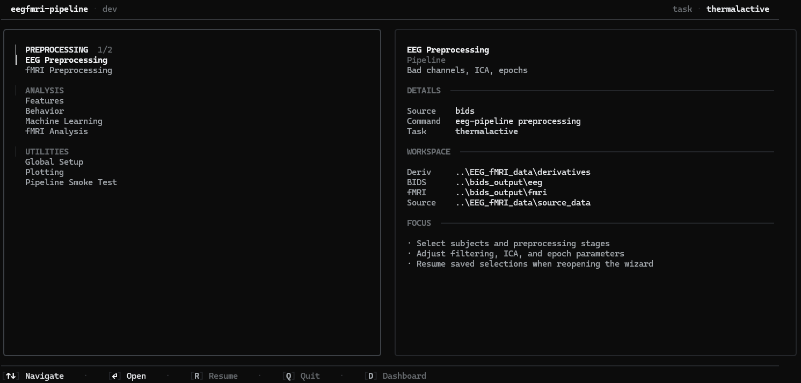

# EEG–fMRI Analysis Pipeline

[](https://www.python.org)
[](LICENSE)
[](https://bids-specification.readthedocs.io/)
[](https://joshuaduq.github.io/eegfmri-pipeline/)

A modular neuroimaging analysis suite for EEG, fMRI, and multimodal
EEG–fMRI research. The pipeline runs from BIDS-formatted raw data through
preprocessing, feature extraction, behavioral statistics, machine learning,
source localization, and fMRI analysis from a single CLI or interactive TUI.

The project is organized around explicit data contracts, documented derivatives,
and method-specific reference pages so that analysis steps can be inspected and
reproduced rather than reconstructed from ad hoc scripts.

It began as an effort to reduce the amount of one-off glue code required for
day-to-day EEG and fMRI work. That motivation is still visible in the emphasis
on a single command surface, BIDS-aligned inputs, and a TUI that exposes the
same workflows without requiring users to memorize flags.

The Sphinx documentation is the canonical source for all detailed methods,
configuration, output formats, and command references.

<p align="center">
  
</p>

## What It Does

- EEG preprocessing with artifact detection, ICA, epoching, and cleaned derivative generation
- Trial-level and **resting-state** EEG feature extraction across 16 documented feature families
- Behavioral statistics with robust inference and multiple-comparison control
- Nested machine-learning workflows for regression and classification
- EEG source localization workflows with template and subject-specific paths
- fMRI preprocessing plus GLM-based first-level, second-level, and trial-wise analysis
- Interactive TUI and CLI interfaces for configuration, inspection, and batch execution

## Documentation

The Sphinx documentation is the source of truth for operational guidance,
methods, configuration keys, and output schemas.

- [Documentation home](https://joshuaduq.github.io/eegfmri-pipeline/)
- [Installation guide](https://joshuaduq.github.io/eegfmri-pipeline/install.html)
- [Quick start](https://joshuaduq.github.io/eegfmri-pipeline/user_guide/quickstart.html)
- [User guide](https://joshuaduq.github.io/eegfmri-pipeline/user_guide/index.html)
- [Methods reference](https://joshuaduq.github.io/eegfmri-pipeline/methods/index.html)
- [API reference](https://joshuaduq.github.io/eegfmri-pipeline/api/index.html)
- [FAQ](https://joshuaduq.github.io/eegfmri-pipeline/faq.html)
- [Contributing](https://joshuaduq.github.io/eegfmri-pipeline/contributing.html)

## Requirements

- Python 3.11 or later
- Git for cloning the repository
- Go 1.21+ only if you want to build the optional TUI
- Docker or Apptainer for fMRI preprocessing workflows
- A FreeSurfer license for fMRI preprocessing and source-localization workflows

See the [installation guide](https://joshuaduq.github.io/eegfmri-pipeline/install.html)
for environment variables, optional components, and the Docker image used by
the source-localization path.

## Platform Support

| Platform | Native support | Notes |
| --- | --- | --- |
| macOS | Yes | Full CLI/TUI support. |
| Windows | Yes, for install + CLI + TUI + validation + smoke checks | Use native Windows for the repo-owned interface layer. |
| Windows heavy imaging workflows | No native guarantee | Use WSL2 or containers for container-backed fMRI preprocessing and Docker-based BEM/source-localization helpers. |

## Install

### macOS / Linux

```bash
git clone https://github.com/JoshuaDuq/eegfmri-pipeline.git
cd eegfmri-pipeline
python3 -m venv .venv
source .venv/bin/activate
pip install -e ".[dev,ml]"
```

### Windows PowerShell

```powershell
git clone https://github.com/JoshuaDuq/eegfmri-pipeline.git
cd eegfmri-pipeline
py -m venv .venv
.venv\Scripts\Activate.ps1
pip install -e ".[dev,ml]"
```

Windows setup is different from macOS/Linux:
- use `PowerShell` or `cmd`, not `source`
- create the env with any `Python 3.11+` interpreter
- activate with `.venv\Scripts\Activate.ps1`
- use `python.exe` from `Scripts\`, not `bin/python`

If you have multiple Python versions installed, make sure the selected
interpreter is `3.11+`. For example, use `python3.12 -m venv .venv` or
`py -3.12 -m venv .venv`.

The `ml` extra installs PyTorch and is only required for the CNN classifier.
If you do not need that model, `pip install -e ".[dev]"` is sufficient.

## Quick Start

Before running any workflow, verify the dataset roots, derivatives directory,
task label, and analysis configuration. For EEG feature extraction, this also
includes the active feature families, frequency bands, and analysis mode.
**The recommended entry point is the TUI**, which writes the same settings the
CLI consumes.

### Using the TUI (recommended)

Build and launch the TUI once after installation:

macOS / Linux:

```bash
cd eeg_pipeline/cli/tui && go build -o eeg-tui . && cd -
./eeg_pipeline/cli/tui/eeg-tui
```

Windows PowerShell:

```powershell
cd eeg_pipeline/cli/tui
go build -o eeg-tui.exe .
.\eeg-tui.exe
```

On Windows, do not use the macOS/Linux launch pattern (`./eeg-tui` or
`source .../bin/activate`). The native path is `.\eeg-tui.exe` from
PowerShell and the Python environment lives under `Scripts\`.

The TUI walks you through every configuration step interactively—pipeline
selection, subject selection, feature families, frequency bands, spatial
options, time ranges, preprocessing stages, and advanced options—before
assembling and running the underlying CLI command. No flags to memorize; the
wizard validates your choices at each step and shows a live summary on the
home screen.

### Using the CLI directly

If you prefer scripting or headless execution, configure
`eeg_pipeline/utils/config/` first, then:

```bash
eeg-pipeline validate quick
eeg-pipeline info subjects
eeg-pipeline preprocessing full --subject 0001
eeg-pipeline features compute --subject 0001 --analysis-mode trial_ml_safe
eeg-pipeline ml regression --all-subjects
```

CLI flags for feature extraction (`--categories`, `--bands`, `--rois`, etc.) map
directly to the wizard steps in the TUI. See the
[Quick start guide](https://joshuaduq.github.io/eegfmri-pipeline/user_guide/quickstart.html)
for the full walkthrough.

Run `eeg-pipeline validate quick` before any batch job so dataset and
configuration errors surface early.

For native Windows users, keep the lightweight repo-owned workflows native
(install, TUI, CLI, validation, smoke checks). Use WSL2 or container-backed
execution for fMRI preprocessing and Docker-based BEM/source-localization
helpers.

## Feature Extraction

Feature extraction supports both **task-based** (event-related, trial-level)
and **resting-state** paradigms. The `--analysis-mode` flag controls
cross-trial leakage behavior:

- `group_stats` — descriptive/group analysis mode
- `trial_ml_safe` — per-trial features suitable for ML pipelines

For resting-state extraction, set `task_is_rest: true` (config) or pass
`--task-is-rest` on the CLI.

Feature families (power spectra, connectivity, complexity, etc.) and frequency
bands are selected per-run via the TUI wizard or the corresponding CLI flags.

For method details, formulas, and output contracts, use the
[Methods reference](https://joshuaduq.github.io/eegfmri-pipeline/methods/index.html)
rather than the README.

## Current Scope

The EEG pipeline, feature extraction, behavioral statistics, machine learning,
and source-localization workflows are documented and maintained. The fMRI
pipeline and plotting commands are still evolving, so validate critical
workflows after upgrading and confirm derivative paths before using them in
downstream analyses.

## Contributing

Use short imperative commit subjects and keep changes focused. See the
[contributing guide](https://joshuaduq.github.io/eegfmri-pipeline/contributing.html)
for branch naming, testing, and pull-request expectations.

## License

MIT. See [LICENSE](LICENSE).
