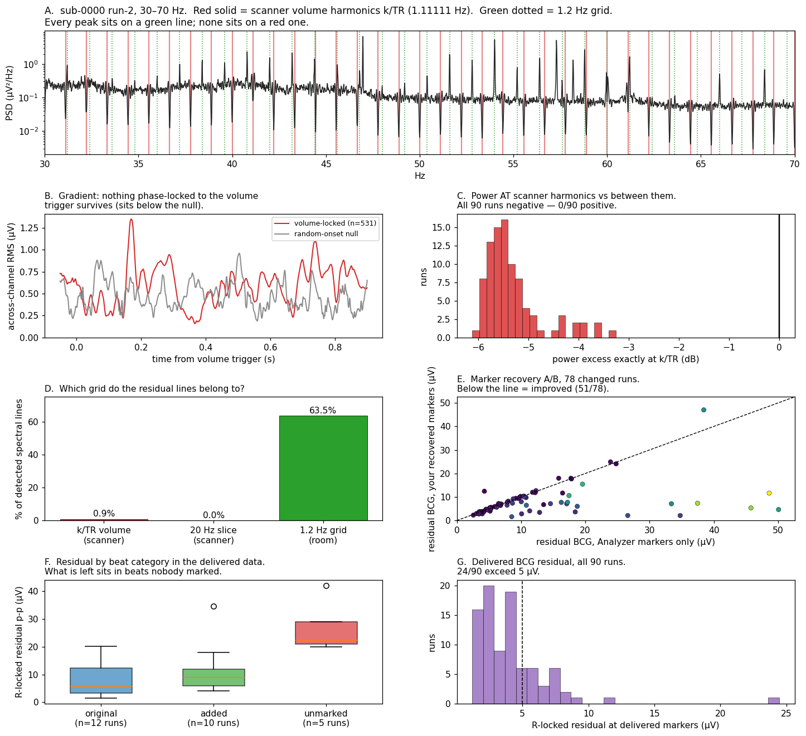

# Was Analyzer's MRI artifact correction done properly?

Audit of `bids_output/eeg`, 2026-08-17. 90 recordings, 15 participants, Siemens Prisma 3T,
TR 0.9000 s, 54 slices, multiband 3, 1000 Hz, 63 EEG + 1 ECG, 60 Hz mains.

Two questions, two different answers.

| | Verdict | Key evidence |
|---|---|---|
| **Gradient (AAS)** | Correct. Nothing scanner-locked survives. | On-grid power excess −5.47 dB median, **0/90 runs positive**; volume-locked average 0.56× its own null |
| **Pulse (BCG)** | Incomplete. ~1,200 beats were never marked, so never corrected. | 1,082 marker gaps, **98.8% contain a real beat**; 20–42 µV residual at those beats |

---

## 1. The gradient correction is fine

Residual gradient artifact is necessarily phase-locked to the volume trigger, so it has to
show up in two places. It shows up in neither.

The volume markers give TR = 0.9000000 s with **zero jitter**, so the harmonic grid is known
exactly: 1.11111 Hz and multiples, with the slice rate (54 slices ÷ MB 3 = 18 excitations
per TR) landing at 20.000 Hz.

- **Frequency domain.** Power measured *at* the k/TR harmonics against the background
  *between* them: median **−5.47 dB**, and negative in all 90 runs. There is less energy at
  the scanner frequencies than beside them.
- **Time domain.** The volume-locked average sits at **0.56×** a random-onset null with the
  same epoch count (median; max 1.98, 0/90 above 2×). Nothing phase-locked remains.

### The trap worth naming

These recordings *do* carry a dense comb of narrow lines to 250 Hz, and reading that as a
failed gradient correction is the obvious mistake. The comb is spaced **1.2 Hz, not
1.11111 Hz**. The two grids separate by 0.1–0.5 Hz within the first hundred harmonics —
6–34 bins at the 0.0156 Hz resolution used here — so they are not confusable.

| Grid | Share of detected lines | Chance if random |
|---|---|---|
| k/TR volume (scanner) | **0.0%** | 3.6% |
| 20 Hz slice (scanner) | **0.0%** | 0.2% |
| 1.2 Hz (environmental) | **63.5%** | 3.3% |

The strongest single feature is **57.22 Hz, present in 82 of 90 runs at ~19.5 dB**, on no
scanner grid at all.

AAS is triggered by the volume marker and can only remove what repeats with the TR. A
continuously running 1.2 Hz source is invisible to it by construction — this is a shielding
and environment problem needing its own removal step, not evidence against the correction.
(See `scanner_harmonic_diagnosis.md` and the `eeg_linecleaned` stage.)

---

## 2. The pulse correction missed beats

Evidence is internal to the marker train: 1,082 intervals across the cohort run to ≥1.5×
the local median R–R. Checking the ECG inside each one against a template built from the
markers themselves, **98.8% contain a real, beat-shaped event**, carrying 1.98× a normal
interval's worth of beat features. The heart kept beating; the detector stopped marking.

Residual in the delivered data, locked to three disjoint beat sets:

| Beat set | R-locked residual |
|---|---|
| Marked by Analyzer | 2–8 µV |
| Added by the recovery | 5–20 µV |
| **Still unmarked** | **20–42 µV** (up to 5.2× null) |

`sub-0008 run-4` is a separate category: 110 markers against roughly 530 beats in the ECG.
Visual inspection shows large QRS complexes every ~0.9 s with no marker on most of them.

---

## 3. Did the recovery script help?

`reference_bcg_pre_recovery/` makes this controlled: the same Analyzer BCG correction against
its own markers instead of the recovered set. Scored on posterior/temporal channels where
BCG is largest, over the delivered marker set.

**Yes, substantially.** Across the 78 runs it changed:

- summed residual **955 → 608 µV (−36.3%)**
- at the added beats specifically **63.7 → 19.1 µV (−71.9%)**, better in 34 of 36 runs
- it introduced no false detections — the 180 double-marked cycles are present *identically*
  before and after, so they are Analyzer's, not the script's
- runs fully resolved (0 implied missing beats): **10 → 22**

| Biggest wins | Added | Before | After | |
|---|---|---|---|---|
| sub-0008 run-4 | +66 | 34.77 | 2.11 | −93.9% |
| sub-0010 run-1 | +85 | 26.60 | 2.12 | −92.0% |
| sub-0001 run-1 | +207 | 50.08 | 4.66 | −90.7% |
| sub-0004 run-3 | +302 | 45.78 | 5.35 | −88.3% |

| Regressions >10% | Added | Before | After | |
|---|---|---|---|---|
| sub-0005 run-6 | +3 | 4.29 | 12.45 | **+190.1%** |
| sub-0001 run-2 | +176 | 38.44 | 47.02 | +22.3% |
| sub-0013 run-2 | +10 | 15.85 | 17.98 | +13.4% |
| sub-0011 run-4 | +14 | 6.50 | 7.21 | +10.9% |

27 of 78 runs came out slightly worse. The mechanism: Analyzer rebuilds its pulse template
by averaging across *all* marked beats, so a handful of mistimed or spurious markers degrades
the template used to correct every beat in the run. That is how three added markers move
sub-0005 run-6 by 190%.

---

## 4. Two bugs found, both fixed

### 4.1 The delivered cohort was built from stale code

`step2_pulse_markers_recovered_v2` — which feeds step 3 and therefore the delivered BIDS
tree — predates the `MAXIMUM_BEAT_PERIOD_S` cap now in `detect.py`. Running the current code
on `sub-0008 run-4` produces **451 markers, matching `step2_..._v3_sub0008_only` exactly**,
against the 110 in the delivered data. Every other run checked reproduces v2 to within a few
markers, so this is the one recording affected.

**Nothing to fix in code — it needs a re-run.** The v3 markers already exist on disk and were
never carried into step 3.

### 4.2 Analyzer's double marks disarmed the filter meant to catch them

On some runs Analyzer marks one cardiac cycle twice, once on the QRS and once on the
magnetohydrodynamic deflection riding the T-wave — 180 cycles cohort-wide, all six sub-0005
runs plus sub-0007 runs 3 and 5. The recovery only ever *adds* beats, so every one survived.

They did more damage than their count suggests. `physiological_floor` read a low percentile
of Analyzer's raw intervals, and on a double-marked run **those short intervals are the low
percentile**:

| | modal RR | floor | ratio |
|---|---|---|---|
| sub-0005 (double-marked), before fix | 1.10 s | 0.52 s | **0.48×** |
| sub-0014 (clean) | 1.01 s | 0.75 s | 0.75× |
| sub-0005, after fix | 1.02–1.10 s | 0.76–0.78 s | 0.69–0.75× |

So the filter that rejects implausibly close recovered beats was loosened by exactly the runs
whose markers were least trustworthy.

**Changes to `studies/pain_study/analysis/bcg/detect.py`:**

- **`modal_interval()`** — new. The beat period as the densest interval, which survives both
  failure modes that break the alternatives: a sparsely marked run inflates the median
  (sub-0008 run-4 reads 4.07 s against a true 1.0 s), and a double-marked run deflates a low
  percentile. Includes a split-cycle correction: comparable mass at ~2× the mode means the
  mode *is* the split, since double-marking creates a cluster at a sub-multiple of the period
  and nothing creates one at a multiple.
- **`drop_double_marks()`** — new. Removes the second mark in a cycle, choosing by ECG
  evidence rather than position: the template is built from cycles marked once, and whichever
  of the pair correlates less with it goes.
- **`physiological_floor()`** — split intervals excluded before the percentile is read, and
  both the percentile and the cap measured against the modal interval rather than the median.
- **`RecoverySettings.clear_double_marks`** — on by default; cleared *before* gaps are
  searched, since the floor and the gap threshold are both computed from these intervals.
- **`BeatQuality.double_marks_dropped`** — reported per run.

Effect on real data — surgical, with every clean run bit-identical:

| Run | Analyzer | old code | new code | dropped | resulting bpm | min RR |
|---|---|---|---|---|---|---|
| sub-0005 run-5 | 588 | 594 | **457** | 138 | 57 | 0.794 |
| sub-0005 run-6 | 496 | 499 | **432** | 72 | 55 | 0.730 |
| sub-0007 run-3 | 484 | 496 | **483** | 21 | 58 | 0.745 |
| sub-0008 run-4 | 44 | 451 | 451 | 0 | 54 | 0.750 |
| sub-0014 run-1 | 497 | 499 | 499 | 0 | 60 | 0.832 |
| sub-0013 run-1 | 418 | 418 | 418 | 0 | 51 | 0.802 |
| sub-0012 run-1 | 272 | 443 | 443 | 0 | 54 | 0.606 |

All six sub-0005 runs now resolve to 1.02–1.10 s (55–59 bpm), coherent across the session,
where before three of them reported ~0.53 s. 91 tests pass across
`tests/analysis/bcg/`, `tests/scripts/cardiac_gaps/` and `tests/cli/test_cli_cardiac_gaps_paths.py`.

### End-to-end run

`eeg-pipeline cardiac-gaps report` was run on both affected subjects. The workflow completes
and `double_marks_dropped` reaches the report row through the existing reflection over
`BeatQuality` fields, so no reporting code needed changing.

`sub0008`, where the stale-code fix bites:

| run | analyzer | combined | recovered | gaps before → after | ECG lock ratio |
|---|---|---|---|---|---|
| 1 | 395 | 493 | 98 | 161.0 s → 0.0 s | 3.73 → 3.87 |
| 3 | 409 | 496 | 87 | 142.3 s → 0.0 s | 4.00 → 3.98 |
| **4** | **44** | **451** | **407** | **482.1 s → 98.5 s** | **3.96 → 4.28** |
| 6 | 238 | 476 | 238 | 309.0 s → 0.0 s | 3.77 → 3.81 |

`sub0005`, where the double-mark fix bites: 29–138 marks dropped per run, every run landing
at 53–59 bpm. Two runs improve their reported status from `too_few_recovered` to `ok`
(run 1: 7 → 9 recovered; run 6: 3 → 8), and sub-0007 run 3 goes from 12 to 20 recovered.

Running it also surfaced something the unit tests could not: **clearing the double marks
un-masks sub-0005 run 4's real gaps.** With the false marks in place its interval
distribution hid them; cleaned, the run shows 110 s of genuine gap time, of which the
recovery closes 42 s. That run needs attention it was not previously getting.

### Two things left alone deliberately

- **`too_few_recovered` fires on runs that succeeded.** sub-0005 run 5 closes its gaps from
  15.5 s to 1.6 s — a 90% reduction — and is still labelled a failure, because the status
  gates on an absolute count of recovered beats (<8) rather than on whether the gaps closed.
  This is **pre-existing**, not introduced here, and the changes above move two runs off it.
  Fixing it properly means choosing a new criterion, which is a verdict threshold and so a
  call for the study owner rather than something to invent here.
- **`gap_seconds_before` is measured on the uncleaned train** while `gap_seconds_after` is
  measured on the cleaned one, so the two are not quite on the same footing. Kept that way
  because "gaps in what Analyzer delivered" is the meaningful baseline for the report, but
  it is worth knowing when reading the before/after columns.

Since sub-0005 run-6's regression came from three added markers on a run carrying 72 false
Analyzer marks, clearing those is the most likely fix for it — but that needs an Analyzer
re-run to confirm, since the delivered correction is Analyzer's, not this workflow's.

---

## 5. Rework scope: which recordings actually change

Every one of the 90 was re-run through both code paths and compared. **33 recordings change;
57 are bit-identical and need nothing.** The 33 are not equal, and the distribution is what
should drive the decision:

| Tier | Recordings | Change | Worth regenerating? |
|---|---|---|---|
| **1** | `sub-0008 run-4` | **+341 markers** (110 delivered → 451) | Yes — on its own it is most of the available gain |
| **1** | `sub-0005` runs 1–6 | **453 false marks removed** (32–138 each) | Yes — a whole subject currently corrected against marks with no beat under them |
| **2** | `sub-0007` runs 2–5, `sub-0011` runs 1–3/5/6, `sub-0015` runs 3–6 | 2–21 marks each | Probably — cheap if the batch is running anyway |
| **3** | 19 recordings | **1–4 marks** out of ~500 | No — below the level at which Analyzer's averaged template can notice |

Tiers 1 and 2 are ~14 recordings and carry essentially all the benefit. `sub-0001 run-1` also
shows a small stale-code difference (381 delivered vs 386 current), which is tier-3 sized.

## 6. What is still open

In order.

1. **Build the accept/revert gate first, before regenerating anything.** It cannot live in
   `detect.py` — the delivered correction is Analyzer's re-run, so the check belongs at the
   step 2 → step 3 boundary: measure R-locked residual per run against
   `reference_bcg_pre_recovery` and keep the recovered markers only where they help. Doing
   this first means the regeneration below is verified rather than assumed, which matters
   because last time 27 of 78 runs came out worse and nothing caught it.
2. **Regenerate tiers 1 and 2 (~14 recordings)** through step 2 → Analyzer → step 3 → BIDS.
   Skip tier 3 unless the Analyzer batch is cheap enough that running all 33 is simpler than
   selecting.
3. **Re-run the downstream stages** for whatever was regenerated: BIDS conversion, then the
   line-comb removal into `eeg_linecleaned`, then preprocessing.
4. **18 runs still have ≥20 unmarked beats**, led by sub-0001 run-1 (122), sub-0012 run-1
   (98), sub-0004 run-3 (82), sub-0011 run-1 (55). This is where the 20–42 µV residual lives,
   and the recovery does not currently close it.
5. **The 1.2 Hz comb and the 57.22 Hz line are untouched by any of this**, and at ~19.5 dB in
   82 of 90 runs they are now the largest remaining spectral artifact in the dataset. They
   belong to the line-removal stage, not to AAS or BCG.

---

## Method notes

Every locked-average measurement is paired with a random-onset null from the same recording
with the same epoch count, so unrelated activity averages down equally and only phase-locked
structure survives. Comb measurements use 64 s Welch windows (0.0156 Hz) so the teeth are
resolved between one another, with the background taken from an annulus between neighbouring
harmonics.

Two corrections made during the analysis, both of which changed numbers:

- The BrainVision header carries no channel types, so MNE reads the ECG trace as EEG. Its
  power is ~100× the scalp channels' and dominates any across-channel mean spectrum.
  Excluding it cut the spurious line count ~40% and raised the 1.2 Hz grid share from ~30% to
  ~67% — it *strengthened* the result.
- A first attempt at independent beat detection over-counted ~2×, because the QRS and the
  magnetohydrodynamic deflection both match a beat template. The missed-beat claim therefore
  rests on the narrow "is there a beat inside *this* gap" test, not on a global beat count.
